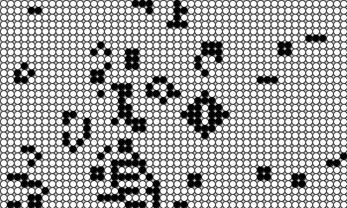

# Emerging Art

This repo contains several generative art projects undertaken by me.
Sketches are made in processing and can be run using that IDE. Examples of the sketches are found in the images directory.

### Cellular Automata

This directory contains projects relating to cellular automata, most notably Conway's Game of Life.
Running this sketck shows Conway's game of life. Pressing the `ENTER` key takes a screenshot of the current frame.
Example of Conway's Game of Life:

